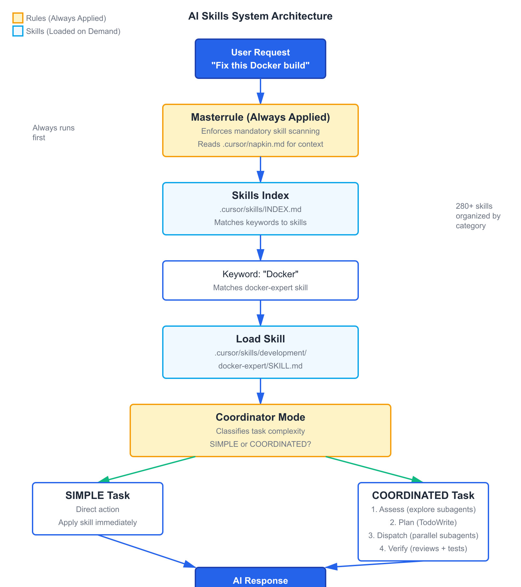

# AI Skills Engine

> **A comprehensive collection of 227 expert skills and intelligent automation rules for Cursor IDE**

Transform your AI coding assistant with enforced expertise, automatic skill discovery, and multi-agent orchestration.

[](LICENSE)
[](https://github.com/payals/ai-skills-engine/releases)
[](dot_cursor/skills/INDEX.md)
[](docs/RULES.md)
[](docs/SELF_EVOLUTION.md)
[](docs/CUSTOM_SKILLS.md)

---

## Table of Contents

- [Overview](#overview)
- [Quick Start](#quick-start)
- [Examples](#examples)
- [Features & Benefits](#features--benefits)
- [Architecture](#architecture)
- [Skill Categories](#skill-categories)
- [Use Cases](#use-cases)
- [Documentation](#documentation)
- [Advanced Features](#advanced-features)
- [Custom Skills & Workflows](#custom-skills--workflows)
- [Using with Other IDEs](#using-with-other-ides)
- [Contributing](#contributing)
- [Attributions](#attributions)
- [Troubleshooting](#troubleshooting)
- [License](#license)

---

## Overview

This repository contains a pre-configured `.cursor` directory with:

- **227 Skills**: Specialized AI capabilities across development, AI/ML, databases, document processing, and more
- **Intelligent Rules System**: Automatic skill discovery and application via the masterrule
- **Skills Index**: Searchable catalog that helps AI find and apply the right expertise automatically
- **Persistent Memory**: Napkin system that learns from mistakes and user preferences across sessions
- **Multi-Agent Orchestration**: Coordinator mode for complex tasks with parallel subagent dispatch
- **Project Tracker**: Persistent history journal for tracking completed work across sessions
- **Self-Evolution System**: Learns from napkin and tracker to automatically improve rules, skills, and workflows
- **Prompt Queue**: Batch sequential prompts with dynamic variable passing ([cursor-prompt-queue](https://github.com/payals/cursor-prompt-queue))

**The key differentiator**: The **masterrule** ensures skills are **automatically scanned and applied** in every session. Your AI assistant doesn't just have access to skills—it's **required** to use them.

---

## Quick Start

### Installation (2 minutes)

```bash
# 1. Clone this repository
git clone https://github.com/yourusername/ai-skills-engine.git
cd ai-skills-engine

# 2. Copy to your Cursor project
cd /path/to/your/project
cp -r /path/to/ai-skills-engine/dot_cursor .cursor

# 3. Open Cursor IDE - skills are now active!
```

That's it! The masterrule will automatically start using skills in your next session.

**Note**: This includes the self-evolution system (`.cursor/evolution/`) which is disabled by default. See [Advanced Features](#-advanced-features) to learn about enabling it.

### Verify Installation

Open Cursor and ask: *"What skills are available?"*

The AI should read `.cursor/skills/INDEX.md` and list available skills with a "Skill Proof" header.

---

## Examples

### Example 1: Docker Optimization

```
You: "My Docker build is taking 10 minutes. Help optimize it."

AI: ## Skill Proof
    Skills Used: docker-expert
    Key Principle: Multi-stage builds + layer caching
    
    [Applies Docker expertise automatically]
    - Analyzes Dockerfile
    - Suggests multi-stage build pattern
    - Optimizes layer caching
    - Reduces build time to 2 minutes
```

### Example 2: Bug Fixing

```
You: "Getting a TypeError in my React component"

AI: ## Skill Proof
    Skills Used: error-resolver, senior-frontend
    
    [Systematically diagnoses]
    - Root cause analysis
    - Checks component lifecycle
    - Provides fix with explanation
```

### Example 3: Feature Planning

```
You: "I want to add user authentication"

AI: ## Skill Proof
    Skills Used: brainstorming, create-plan, senior-backend
    
    [Structured approach]
    1. Explores requirements (OAuth? JWT? Session-based?)
    2. Creates implementation plan
    3. Suggests security best practices
    4. Provides code scaffolding
```

---

## Features & Benefits

**The Problem:** In default Cursor, skills are optional files that *might* get used. There's no enforcement, no automatic discovery, and no proof of which expertise was applied.

**The Solution:** AI Skills Engine adds:

1. **Mandatory Skill Scanning** - `masterrule.mdc` with `alwaysApply: true` enforces skill usage before every response
2. **Automatic Discovery** - `INDEX.md` maps keywords to skills, so the right expertise is found automatically
3. **Proof of Expertise** - Every response shows which skills were applied via "Skill Proof" header
4. **Structured Orchestration** - Coordinator mode provides rules for multi-agent tasks (conflict prevention, reviews, testing)

| Feature | Default Cursor | AI Skills Engine |
|---------|---------------|------------------|
| Skill Usage | Optional, manual | Mandatory, automatic |
| Discovery | Manual reference | Keyword matching |
| Proof | None | Skill Proof header |
| Multi-Agent | Ad-hoc | Structured orchestration |

**[Read detailed comparison →](docs/WHY.md)**

---

## Architecture



The system uses an always-applied rule (masterrule) that enforces a mandatory skill scanning protocol:

1. **User makes a request** → Masterrule intercepts
2. **Reads Skills Index** → Matches keywords to relevant skills
3. **Loads SKILL.md files** → Applies expert knowledge
4. **Coordinator classifies** → Simple (direct) or Complex (subagents)
5. **Delivers response** → With skill proof showing what was applied

**[Learn more about the architecture →](docs/RULES.md)**

---

## Skill Categories

<details>
<summary><b>Development (80+ skills)</b> - Core coding, testing, planning</summary>

- `brainstorming` - Explore requirements before implementation ⭐
- `senior-backend` - Backend systems (Node, Go, Python, Postgres)
- `senior-frontend` - Frontend (React, Next.js, TypeScript)
- `docker-expert` - Container optimization and security
- `git-commit` - Conventional commits with intelligent staging
- `code-reviewer` - Comprehensive code review
- `verification-before-completion` - Evidence-based completion ⭐
- `test-driven-development` - TDD workflow
- `error-resolver` - Systematic error diagnosis
- `senior-architect` - System design and architecture
- And 70+ more...

</details>

<details>
<summary><b>AI Research (100+ skills)</b> - LLMs, training, inference</summary>

- `crewai` - Multi-agent orchestration
- `langgraph` - Stateful AI applications
- `prompt-engineer` - LLM optimization
- `rag-engineer` - Retrieval-augmented generation
- `fine-tuning-axolotl` - Fast fine-tuning
- `distributed-training-deepspeed` - ZeRO optimization
- `inference-serving-vllm` - High-throughput serving
- `evaluation-lm-harness` - Model benchmarking
- And 90+ more...

</details>

<details>
<summary><b>Database (10+ skills)</b> - Schema design, optimization</summary>

- `using-neon` - Neon Serverless Postgres
- `supabase-postgres-best-practices` - Query optimization
- `database-schema-designer` - Schema design patterns

</details>

<details>
<summary><b>Document Processing (15+ skills)</b> - PDF, Word, Excel</summary>

- `pdf` - PDF manipulation and extraction
- `docx` - Word document processing
- `xlsx` - Excel spreadsheet handling
- `pptx` - PowerPoint creation

</details>

<details>
<summary><b>Problem Solving (6 skills)</b> - Creative techniques</summary>

- `when-stuck` - Dispatch to right technique when blocked ⭐
- `collision-zone-thinking` - Force unrelated concepts together
- `inversion-exercise` - Flip assumptions
- `simplification-cascades` - Find insights that eliminate complexity

</details>

<details>
<summary><b>Web Development (15+ skills)</b> - React, Shopify, SEO</summary>

- `react-best-practices` - 40+ performance rules
- `shopify-development` - Shopify apps and themes
- `segment-cdp` - Customer data platform patterns

</details>

<details>
<summary><b>Workflow Automation (15+ skills)</b> - n8n, GitHub Actions</summary>

- `n8n-*` - n8n workflow patterns and validation
- `github-workflow-automation` - GitHub Actions and CI/CD
- `inngest` - Serverless background jobs

</details>

<details>
<summary><b>Utilities (10+ skills)</b> - Browser automation, tools</summary>

- `playwright-skill` - Browser automation
- `browser-extension-builder` - Chrome/Firefox extensions
- `domain-name-brainstormer` - Domain availability checking

</details>

**[Browse full skills index →](dot_cursor/skills/INDEX.md)**

---

## Use Cases

### Perfect For:

- **AI/ML Engineers**: 100+ skills for training, fine-tuning, inference, evaluation
- **Full-Stack Teams**: Backend, frontend, database, DevOps expertise
- **Startup Builders**: Rapid prototyping with best practices built-in
- **Solo Developers**: Access to senior-level expertise across all domains
- **Open Source Maintainers**: Code review, testing, documentation skills
- **Technical Writers**: Document processing and co-authoring workflows

### Real-World Applications:

- 🏗️ **Architecture Design**: System design with trade-off analysis
- 🐛 **Bug Fixing**: Systematic root cause analysis
- 📝 **Documentation**: Co-authoring with reader testing
- 🔧 **Refactoring**: Clean code principles and patterns
- 🚀 **Deployment**: Docker, Kubernetes, CI/CD automation
- 🧪 **Testing**: TDD, test generation, coverage analysis
- 🤖 **AI Development**: RAG, agents, fine-tuning, evaluation

---

## Documentation

### Core Documentation

- **[Rules System](docs/RULES.md)** - How the 7 core rules work (masterrule, coordinator, etc.)
- **[Architecture](docs/RULES.md#how-rules-work-together)** - System design and flow
- **[Skills Index](dot_cursor/skills/INDEX.md)** - Complete catalog of 280+ skills

### Adaptation Guides

- **[VSCode & Other IDEs](docs/OTHER_IDES.md)** - Using skills with VSCode, Continue, Cline
- **[Customization](docs/RULES.md#customizing-rules)** - Adding your own skills and rules

---

## Advanced Features

### 1. Masterrule - Mandatory Skill Scanning

The masterrule **enforces** skill usage before every AI response:

```yaml
---
alwaysApply: true
---
# Masterrule

Before ANY response:
1. Read .cursor/skills/INDEX.md
2. Match keywords to skills
3. Load applicable SKILL.md files
4. Produce "Skill Proof" header
```

**Why it matters**: Without enforcement, AI might forget to use skills. With masterrule, expertise is **automatically** applied.

**[Learn more about masterrule →](docs/RULES.md#1-masterrule-masterrulemdc)**

### 2. Coordinator Mode - Multi-Agent Orchestration

For complex tasks (3+ work streams, multi-module changes), coordinator mode:

- Dispatches up to 4 parallel subagents
- Prevents file conflicts
- Runs spec compliance + code quality reviews
- Manages test execution and reporting

**[Learn more about coordinator mode →](docs/RULES.md#2-coordinator-mode-coordinator-modemdc)**

### 3. Auto Battle-Test Plans

Every plan is automatically validated before presentation:

- Checks 10 dimensions (consistency, edge cases, test coverage, etc.)
- Auto-revises CRITICAL/HIGH issues
- Presents only the final, clean plan

**[Learn more about battle-testing →](docs/RULES.md#3-auto-battle-test-plans-auto-battle-test-plansmdc)**

### 4. Napkin - Persistent Memory

`.cursor/napkin.md` learns across sessions:

- Records mistakes and corrections
- Remembers user preferences
- Notes what worked well
- Compounds learning over time

### 5. Self-Evolution System (Advanced)

**Status**: Disabled by default - opt-in feature for advanced users

`.cursor/evolution/` continuously improves the system:

- Analyzes patterns in napkin and tracker
- Generates improvement proposals (rules, skills, workflows)
- Tracks effectiveness with automatic rollback
- Full safety controls (user approval, backups, monitoring)

**Quick Enable**:
```bash
./.cursor/evolution/scripts/enable.sh
```

**[Learn more about self-evolution →](docs/SELF_EVOLUTION.md)**

---

## Custom Skills & Workflows

This project includes significant original work alongside community-sourced skills:

### Custom Rules (8 rules)

All rules in `.cursor/rules/` are custom creations:

- **masterrule** - Mandatory skill scanning with "Skill Proof" enforcement
- **coordinator-mode** - Multi-agent orchestration with 6-phase protocol
- **auto-battle-test-plans** - Automatic plan validation before presentation
- **anti-hang-subagents** - Context exhaustion prevention
- **tracker-maintenance** - Project history protocol
- **auto-execute-plans** - Plan execution trigger
- **pipeline-execution** - RFP pipeline mode
- **auto-docs-audit** - Documentation maintenance

### Custom Skills (~40-50 skills)

**Fully custom skills** ⭐ include:

- **project-tracker** - Persistent project history journal
- **pipeline-evolution** - Self-improving pipeline system
- **verification-before-completion** - Evidence-before-claims protocol
- **executing-plans** - Batch execution with checkpoints
- **writing-plans** - Comprehensive implementation plans
- **Problem-solving suite** - when-stuck, collision-zone-thinking, inversion-exercise, meta-pattern-recognition, scale-game, simplification-cascades

**Customized skills** 🔧 (adapted from community):

- **brainstorming** - Enhanced with YAGNI enforcement and git-worktree integration

**[Full custom skills documentation →](docs/CUSTOM_SKILLS.md)**

### Custom Workflows

- **[cursor-prompt-queue](https://github.com/payals/cursor-prompt-queue)** - Batch sequential prompts with dynamic variable passing between steps. Fresh context per step without context rot.

### Project Tracker

The project tracker system provides persistent history across sessions:

- **What**: Chronological journal of completed work (features, bug fixes, refactors, docs)
- **When to use**: After meaningful work completion; before substantial work if history matters
- **Format**: Date-based entries with purpose, changes, files, verification, outcome
- **Integration**: Enforced by tracker-maintenance rule, guided by project-tracker skill

**Example entry**:
```markdown
## [2026-03-18] - Feature: User Authentication System

**Purpose**: Implement secure user login and session management

**Changes**:
- Added JWT-based authentication middleware
- Created user login/logout endpoints
- Implemented session token refresh mechanism

**Files Created**:
- src/auth/middleware.ts
- src/auth/jwt.ts
- tests/auth/auth.test.ts

**Verification**:
- All auth tests passing (15/15)
- Manual testing: login, logout, token refresh flows

**Outcome**: Authentication system fully functional
```

**[Learn more about the tracker →](docs/CUSTOM_SKILLS.md#project-tracker)**

---

## Using with Other IDEs

While optimized for Cursor, skills work with:

- **VSCode + GitHub Copilot** - Via workspace instructions
- **VSCode + Continue** - Via custom slash commands
- **VSCode + Cline** - Via custom instructions
- **Any AI code editor** - Manual skill invocation

**[Full adaptation guide →](docs/OTHER_IDES.md)**

### Quick VSCode Setup

```bash
# 1. Copy skills to your project
cp -r /path/to/ai-skills-engine/dot_cursor/skills .cursor/skills

# 2. Create .github/copilot-instructions.md
cat > .github/copilot-instructions.md << 'EOF'
# AI Assistant Instructions

Before responding, check .cursor/skills/INDEX.md for relevant skills.
Read and apply matching SKILL.md files.
Indicate which skills were used.
EOF

# 3. Reference skills in chat
# "@workspace Use the docker-expert skill to optimize this Dockerfile"
```

**Limitations**: No automatic enforcement (manual invocation required)

---

## Contributing

Contributions are welcome! To add a new skill:

1. Fork this repository
2. Create your skill: `dot_cursor/skills/{category}/{skill-name}/SKILL.md`
3. Update `dot_cursor/skills/INDEX.md` to register it
4. Add examples and references
5. Submit a pull request

**[Skill creation guide →](dot_cursor/skills/development/writing-skills/SKILL.md)**

---

## Attributions

This project combines original custom work with skills sourced from the broader Cursor/Claude community.

### Custom Work (Apache 2.0)

- **8 custom rules** - All rules in `.cursor/rules/` are original creations
- **~30-40 fully custom skills** ⭐ - Including project-tracker, pipeline-evolution, verification-before-completion, problem-solving suite, and more
- **~5-10 customized skills** 🔧 - Community skills adapted/extended for this project (e.g., brainstorming with YAGNI enforcement)
- **cursor-prompt-queue** - Batch sequential prompts workflow

### Sourced Skills

We're grateful to these sources for their contributions:

- **[vibeship-spawner-skills](https://github.com/vibeship/spawner-skills)** (Apache 2.0) - AI research and agent development skills (~15-20 skills)
- **Orchestra Research** - Comprehensive AI/ML research skills (~80-90 skills covering distributed training, fine-tuning, inference, post-training, optimization, multimodal, evaluation, MLOps, RAG, safety, interpretability)
- **Anthropic** - Document processing skills (docx, pptx, pdf, xlsx)
- **Vercel Engineering** (MIT) - react-best-practices
- **Supabase** - supabase-postgres-best-practices
- **Microsoft GitHub** - github-workflow-automation
- **Community** - Various development, web, workflow automation, and utility skills

**[Full attributions and license compliance →](ATTRIBUTIONS.md)**

**[Custom skills detailed documentation →](docs/CUSTOM_SKILLS.md)**

### Acknowledgments

Special thanks to:
- **Anthropic** - For Claude and document processing skills
- **Microsoft** - For Cursor IDE and GitHub integration skills
- **vibeship** - For spawner-skills collection
- **Orchestra Research** - For comprehensive AI/ML research skills
- **Vercel, Supabase, and the broader community** - For domain-specific expertise
- **blader** - For the napkin persistent memory pattern

This project stands on the shoulders of giants. We're grateful to the entire Cursor/Claude community for building and sharing these skills.

---

## Troubleshooting

### Skills not loading?

1. Verify `.cursor/skills/INDEX.md` exists
2. Check `masterrule.mdc` is in `.cursor/rules/`
3. Restart Cursor IDE
4. Ask AI: "What skills are available?" to test

### AI not using skills?

1. Ensure your message contains relevant keywords
2. Try explicitly: "Use the docker-expert skill"
3. Check skill is registered in INDEX.md
4. Verify masterrule has `alwaysApply: true`

### Want to disable certain skills?

1. Remove from `.cursor/skills/INDEX.md`, or
2. Delete the skill directory entirely

**[Full troubleshooting guide →](docs/RULES.md#troubleshooting)**

---

## License

Apache License 2.0 - See [LICENSE](LICENSE) file for details.

---

## Acknowledgments

- Inspired by the [Cursor IDE](https://cursor.sh) agent system
- Napkin system adapted from [blader/napkin](https://github.com/blader/napkin)
- Skills curated from community best practices and expert knowledge
- Built with contributions from the AI coding community

---

## Support & Community

- **Issues**: [Open an issue](https://github.com/yourusername/ai-skills-engine/issues)
- **Discussions**: [GitHub Discussions](https://github.com/yourusername/ai-skills-engine/discussions)
- **Updates**: Watch this repo for new skills and improvements
- **Contributing**: See [CONTRIBUTING.md](CONTRIBUTING.md)

---

**Built for the Cursor IDE and AI coding community**
